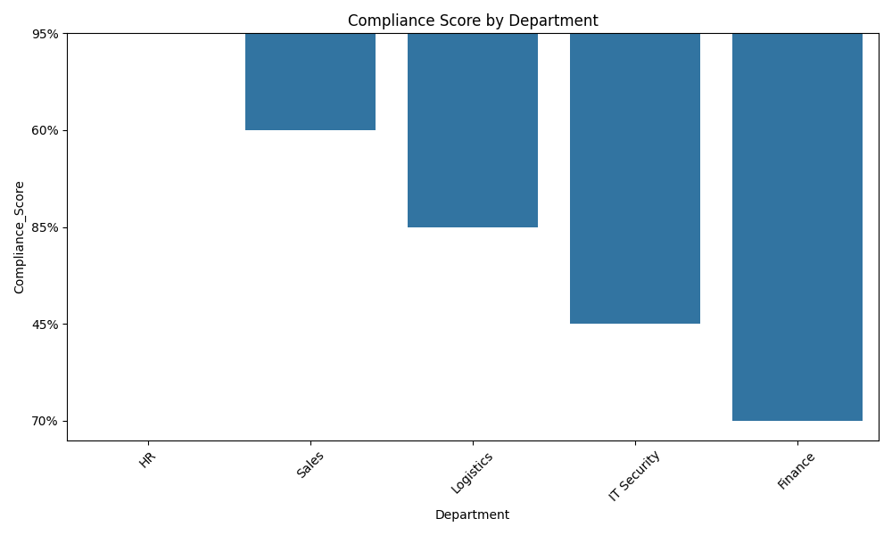

# Compliance Report

This report summarizes the compliance status of applications across departments.

## Compliance Percentage: 40.00%

## Compliance Data:

| App Name | Department | Compliance Score | Audit Date |
|----------|------------|------------------|------------|
| Payroll Portal | HR | 95% | 2026-03-15 |
| Customer CRM | Sales | 60% | 2026-04-01 |
| Inventory Sync | Logistics | 85% | 2026-03-20 |
| Global VPN | IT Security | 45% | 2026-04-05 |
| Legacy Ledger | Finance | 70% | 2026-02-28 |

